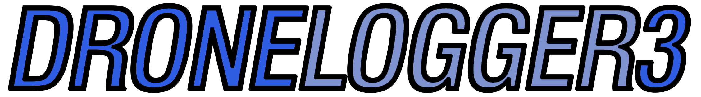
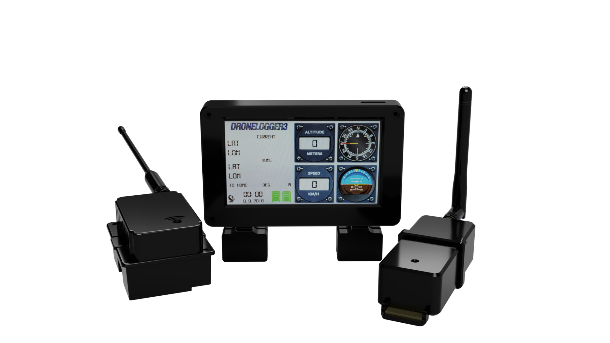

  

<b>
  A UAV tracking / Logging system
  
</b>
A tracking / logging system primarily intended for larger UAVs capable of tracking their movements and logging them onto SD card. Collected data is used to draw artificial horizon and compass, and to display speed, altitude and coordinates of both home position and realtime position.

Currently we are woirking on the developement of its third version, the DroneLogger3:

  

